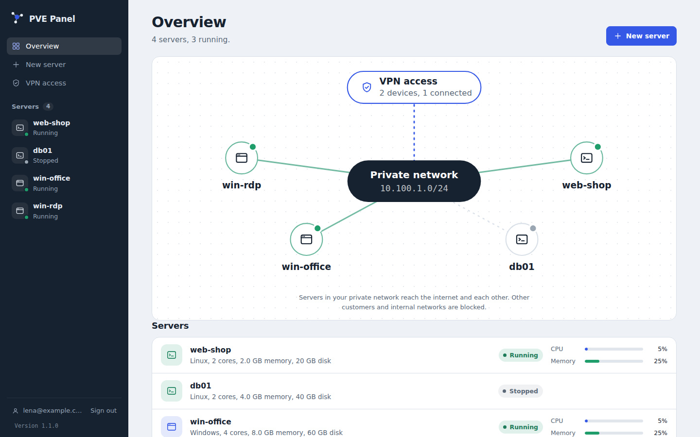

<div align="center">

# PVE Panel

### A modern self-service portal for Proxmox VE

Give users a clean, secure interface to manage **only their own virtual machines and containers** — without exposing the Proxmox VE interface or API credentials.

[](https://www.proxmox.com/)
[](https://nodejs.org/)
[](https://www.docker.com/)
[](#authentication)
[](https://github.com/sebastianflint/pve-panel/pkgs/container/pve-panel)

[Features](#-features) ·
[Architecture](#-architecture) ·
[Quick Start](#-quick-start) ·
[Networking](#-customer-network-isolation) ·
[Authentication](#-authentication) ·
[Deployment](#-deployment) ·
[Security](#-security-model)

</div>

---

## Overview

**PVE Panel** turns a Proxmox VE environment into a lightweight self-service platform.

Users receive a dedicated portal where they can manage assigned servers, open consoles, view usage data, work with snapshots, and — when enabled — provision new systems from administrator-approved templates.

Administrators retain control over templates, quotas, ownership, networking, authentication, and lifecycle operations.

The browser **never communicates directly with Proxmox VE** and never receives the Proxmox API token.

```text
┌──────────────────────┐
│      Customers       │
└──────────┬───────────┘
           │ HTTPS :3000
           ▼
┌──────────────────────────────────────────────┐
│                  PVE Panel                   │
│                                              │
│  Customer Portal        Admin Interface      │
│  :3000                  :3001                │
│                         localhost by default │
│                                              │
│  Fastify · SQLite · Jobs · Auth · Audit      │
└──────────────────────┬───────────────────────┘
                       │ Proxmox API Token
                       ▼
              ┌──────────────────┐
              │   Proxmox VE     │
              │ VM · LXC · SDN   │
              └──────────────────┘
```

The customer and administration portals run as **separate web servers** in the same process. They use separate session cookies and signing keys, and the customer-facing server does not expose administrator routes.

---

## ✨ Features

### Customer self-service

- Start, shut down, restart and force-stop assigned systems
- Manage both **QEMU VMs and LXC containers**
- View live status and guest information
- Display CPU, memory, disk and network usage graphs
- Create, restore and delete snapshots
- Launch an integrated browser console
- Create new servers from administrator-approved templates
- Delete self-created servers
- View provisioning progress and actionable failure messages
- Manage personal VPN devices
- Connect servers to a personal Tailscale network

### Administrator experience

- Create and manage customer accounts
- Assign existing Proxmox VMs or containers to users
- Configure provisioning quotas and limits
- Publish selected templates
- Manage customer-owned servers
- Review provisioning jobs and failures
- Reset passwords and 2FA
- Review the activity/audit log
- Monitor WireGuard and Tailscale usage
- Delete customers together with their owned infrastructure

### Provisioning

PVE Panel supports automated provisioning for both Linux and Windows workloads.

**Linux**

- Cloud-init
- Hostname
- User credentials
- SSH keys
- CPU and memory sizing
- Disk expansion
- DHCP networking
- QEMU Guest Agent integration

**Windows**

- Sysprep-based templates
- Automated OOBE handling
- Administrator password replacement
- Computer rename
- QEMU Guest Agent configuration
- DHCP cleanup and validation
- Windows setup-state detection
- Automatic reboot and readiness checks

---

## 🖼️ Screenshots

> Add screenshots from your deployment here to make the project page even more visual.

| Customer dashboard | Server details |
|---|---|
| `docs/screenshots/customer-dashboard.png` | `docs/screenshots/server-details.png` |

| Admin portal | Provisioning |
|---|---|
| `docs/screenshots/admin-dashboard.png` | `docs/screenshots/provisioning.png` |

Example Markdown once the files exist:

```md

```

---

## 🏗️ Architecture

PVE Panel deliberately separates the customer-facing application from Proxmox VE.

```text
Customer Browser
      │
      │ HTTPS
      ▼
┌───────────────┐
│ Customer UI   │
│ Port 3000     │
└───────┬───────┘
        │
        ▼
┌───────────────────────────────┐
│           PVE Panel           │
│                               │
│ Authentication                │
│ Ownership checks              │
│ Provisioning jobs             │
│ Snapshot / power operations   │
│ Console proxy                 │
│ Audit logging                 │
│ SDN / VPN management          │
└───────────────┬───────────────┘
                │
                │ API token
                ▼
        ┌───────────────┐
        │ Proxmox VE    │
        └───────────────┘
```

Every server-specific request is checked against the internal ownership database before PVE Panel contacts Proxmox.

A resource that does not belong to the signed-in customer is returned as **404**, just like a resource that does not exist.

---

## 🚀 Quick Start

### Requirements

- Proxmox VE 8 or 9
- Node.js **22.13+** for a native installation
- or Docker / Docker Compose
- A dedicated Proxmox API user/token
- Optional: Proxmox SDN for isolated customer networks
- Optional: QEMU Guest Agent for richer VM integration

---

## 1. Prepare Proxmox VE

Create a dedicated service account and a restricted role:

```bash
pveum user add panel@pve --comment "PVE Panel"

# Proxmox VE 9
pveum role add PanelCustomer --privs \
"VM.Audit VM.PowerMgmt VM.Console VM.Snapshot VM.Snapshot.Rollback VM.GuestAgent.Audit"

# On PVE 8 use VM.Monitor instead of VM.GuestAgent.Audit.

pveum pool add customers
pveum acl modify /pool/customers --users panel@pve --roles PanelCustomer

# Token inherits the user's permissions.
pveum user token add panel@pve panel --privsep 0
```

Store the generated token secret securely.

Add customer-managed systems to the dedicated pool:

```bash
pveum pool modify customers --vms 101,102
```

Systems outside the configured customer pool remain outside the panel's effective permission scope.

### Additional permissions for self-service provisioning

Only add these permissions when customers should be allowed to create servers:

```bash
pveum role modify PanelCustomer --append 1 \
  --privs "VM.Allocate VM.Clone VM.Config.CPU VM.Config.Memory VM.Config.Disk VM.Config.Cloudinit VM.Config.Options VM.Config.Network Datastore.AllocateSpace Datastore.Audit"

pveum role modify PanelCustomer --append 1 \
  --privs "VM.GuestAgent.Unrestricted"

pveum pool add templates
pveum pool modify templates --vms 9000,9001
pveum acl modify /pool/templates --users panel@pve --roles PanelCustomer

pveum acl modify /storage/VMStorage \
  --users panel@pve --roles PanelCustomer
```

Newly provisioned servers are automatically added to the pool defined by `PVE_POOL`.

---

## 2. Configure PVE Panel

```bash
git clone https://github.com/sebastianflint/pve-panel.git
cd pve-panel

npm install
cp example.env .env
```

Configure at minimum:

```env
PVE_URL=https://pve.example.com:8006
PVE_TOKEN_ID=panel@pve!panel
PVE_TOKEN_SECRET=your-token-secret
JWT_SECRET=replace-with-a-long-random-secret
```

Create the first administrator:

```bash
npm run user:create -- admin@example.com 'a-long-password' --admin
```

Start the application:

```bash
npm start
```

Development mode:

```bash
npm run dev
```

Default endpoints:

| Interface | Address | Exposure |
|---|---|---|
| Customer portal | `http://host:3000` | Customer-facing |
| Admin portal | `http://127.0.0.1:3001` | Localhost only by default |

For local HTTP testing, set:

```env
COOKIE_SECURE=false
```

---

## 🐳 Deployment

### Docker Compose

```bash
cp example.env .env
docker compose up -d --build
```

Create the first administrator inside the container:

```bash
docker compose exec panel \
  npm run user:create -- admin@example.com 'a-long-password' --admin
```

### Prebuilt image

Published container image:

```text
ghcr.io/sebastianflint/pve-panel
```

The GitHub workflow builds `amd64` and `arm64` images from `main` and release tags.

For a server or NAS deployment, use:

```text
deploy/docker-compose.yml
```

and configure the desired image:

```env
PANEL_IMAGE=ghcr.io/sebastianflint/pve-panel:latest
```

Then deploy:

```bash
docker compose up -d
```

### HTTPS with Caddy

The repository includes a `Caddyfile`.

Set:

```env
PANEL_DOMAIN=panel.example.com
PANEL_PUBLIC_URL=https://panel.example.com
COOKIE_SECURE=true
```

Then start the HTTPS profile:

```bash
docker compose --profile https up -d --build
```

Caddy handles certificate issuance and WebSocket proxying for the browser console.

### UGREEN NAS / UGOS Pro

PVE Panel can also run as a Docker project on compatible UGREEN NAS systems.

A typical deployment directory is:

```text
/volume1/docker/pve-panel
```

For a prebuilt-image deployment, place the deployment `docker-compose.yml` and `.env` in the directory and create a Docker Project in UGOS.

For first-time setup you may define:

```env
INITIAL_ADMIN_EMAIL=admin@example.com
INITIAL_ADMIN_PASSWORD=replace-me
```

Remove `INITIAL_ADMIN_PASSWORD` after the initial account has been created.

---

## 👤 Server ownership

PVE Panel does not rely only on Proxmox permissions to determine which systems a customer can see.

Each assigned resource is tracked in the internal ownership database.

Before any per-server operation is sent to Proxmox, PVE Panel validates ownership.

```text
Request
  │
  ▼
Authenticated customer
  │
  ▼
Ownership lookup
  │
  ├── not owner ──► 404
  │
  └── owner
        │
        ▼
   Proxmox API
```

This applies to:

- status
- power operations
- snapshots
- usage data
- consoles
- deletion
- remote-access operations

---

## 🌐 Customer network isolation

PVE Panel can automatically create one private Proxmox SDN network for each customer.

Enable it with:

```env
CUSTOMER_NETWORKS=true
```

Example:

```text
Customer 1
   │
   └── cu0001 ── 10.100.1.0/24 ──┐
                                   │
Customer 2                         ├── NAT ──► Internet
   │                               │
   └── cu0002 ── 10.100.2.0/24 ──┘
```

Each network receives:

- its own SDN VNet
- dedicated `/24` subnet
- gateway
- DHCP
- NAT
- Proxmox firewall rules
- IP filtering
- MAC filtering
- inter-customer isolation

By default, customer workloads can access the public internet while private/internal networks are blocked.

Typical blocked ranges include:

```text
10.0.0.0/8
172.16.0.0/12
192.168.0.0/16
100.64.0.0/10
169.254.0.0/16
```

This prevents customer workloads from using the Proxmox host as a route into internal networks.

### Required SDN permissions

```bash
pveum role add PanelNetwork --privs "SDN.Allocate SDN.Audit SDN.Use"
pveum acl modify /sdn --users panel@pve --roles PanelNetwork
```

Install `dnsmasq` on the Proxmox host:

```bash
apt install dnsmasq
systemctl disable --now dnsmasq
```

The panel creates and maintains the necessary customer SDN objects when provisioning is enabled.

> **Important**
>
> Customer isolation depends on the Proxmox datacenter firewall being enabled. Validate management access before enabling it remotely.

---

## 🔐 Authentication

### Local authentication

PVE Panel supports traditional username/password authentication with secure server-side controls and rate limiting.

### Two-factor authentication

TOTP-based two-factor authentication is built in.

Compatible apps include:

- 1Password
- Microsoft Authenticator
- Google Authenticator
- Authy
- other RFC 6238-compatible authenticators

Features include:

- QR-code enrollment
- recovery codes
- forced 2FA per user
- administrator reset
- one-time use protection
- encrypted TOTP secrets

### OpenID Connect / SSO

PVE Panel supports OpenID Connect for both the customer and administrator portals.

Tested/provider-compatible scenarios include:

- Microsoft Entra ID
- Keycloak
- Authentik
- Google Workspace
- Okta
- other standards-compliant OIDC providers

The implementation uses:

- Authorization Code Flow
- PKCE (`S256`)
- `state`
- `nonce`
- discovery metadata
- ID-token validation
- optional Pushed Authorization Requests (PAR)
- optional verified-domain restrictions
- issuer + `sub` account binding

Example configuration:

```env
OIDC_ENABLED=true
OIDC_ISSUER=https://id.example.com/realms/example
OIDC_CLIENT_ID=pve-panel
OIDC_CLIENT_SECRET=replace-me

PANEL_PUBLIC_URL=https://panel.example.com
ADMIN_PUBLIC_URL=http://localhost:3001
```

Callback URLs:

```text
https://panel.example.com/api/auth/oidc/callback
http://localhost:3001/api/auth/oidc/callback
```

Once SSO is validated, local password login can optionally be disabled independently for each portal.

---

## 🪟 Windows templates

Windows systems can be deployed without cloud-init.

The repository includes:

```text
docs/windows/unattend.xml
```

Recommended template workflow:

1. Install Windows.
2. Install VirtIO drivers.
3. Install the QEMU Guest Agent.
4. Enable the QEMU Guest Agent in Proxmox.
5. Configure the desired base applications and settings.
6. Ensure the network adapter uses DHCP.
7. Copy and customize `docs/windows/unattend.xml`.
8. Run Sysprep.
9. Shut down the VM.
10. Convert it to a Proxmox template without booting it again.

Example:

```cmd
copy unattend.xml C:\Windows\System32\Sysprep\unattend.xml

C:\Windows\System32\Sysprep\sysprep.exe ^
  /generalize ^
  /oobe ^
  /shutdown ^
  /unattend:C:\Windows\System32\Sysprep\unattend.xml
```

During provisioning PVE Panel can:

- wait for Windows setup to complete
- set the final Administrator password
- verify the password
- rename the computer
- force DHCP on network adapters
- validate that an address was received
- reboot the VM
- report provisioning failures to the customer

---

## 🐧 Linux templates

Linux provisioning uses cloud-init.

A template should contain:

- a cloud-init-compatible image
- a cloud-init drive
- DHCP networking
- optionally `qemu-guest-agent`

PVE Panel applies:

- hostname
- username/password
- SSH keys
- CPU
- memory
- network configuration
- disk expansion

---

## 🔌 Remote access

PVE Panel supports multiple ways to reach customer systems without exposing Proxmox itself.

### Browser console

Customers can launch one-time console sessions directly from the panel.

Console sessions are:

- bound to the requesting user
- single-use
- short-lived
- proxied through PVE Panel

### WireGuard VPN

An optional central WireGuard gateway can provide remote access into each customer's private network.

```text
Laptop / Phone
      │
      │ WireGuard
      ▼
Public IP : UDP 51820
      │
      ▼
┌──────────────────┐
│ WireGuard Gateway│
└─────────┬────────┘
          │
          ├── Customer 1 VPN clients → Customer 1 VNet only
          └── Customer 2 VPN clients → Customer 2 VNet only
```

Customers can:

- add VPN devices
- download configuration files
- scan QR codes
- see connection state
- remove devices

Private keys are shown once and are not retained by the panel.

### Tailscale

When enabled, customers can connect individual servers to their own Tailscale account.

Supported modes:

- **Single server** — expose only that server through the customer's tailnet
- **Private-network gateway** — advertise the customer's private subnet through a Linux VM

PVE Panel installs and configures Tailscale through the QEMU Guest Agent.

The customer's Tailscale account itself is never managed by the panel.

---

## 🛡️ Security model

PVE Panel was designed so that giving customers self-service access does **not** mean giving them Proxmox access.

Key controls include:

- Dedicated Proxmox service account
- Restrictive custom Proxmox roles
- Resource pool scoping
- Application-level ownership validation
- Separate customer and admin HTTP servers
- Separate customer/admin sessions
- Admin interface bound to localhost by default
- `httpOnly` session cookies
- `SameSite=Strict`
- Rate limiting
- Short-lived, user-bound console tickets
- User-bound task tracking
- Audit logging
- Optional TOTP 2FA
- OIDC with PKCE and token validation
- Customer-specific SDN isolation
- VM firewall enforcement
- IP and MAC filtering
- Restricted VPN routing
- Proxmox API token kept server-side

### TLS to Proxmox

For production deployments, use a trusted Proxmox certificate or provide the Proxmox CA:

```env
PVE_CA_FILE=/app/certs/pve-root-ca.pem
```

Avoid:

```env
PVE_VERIFY_TLS=false
```

outside development environments.

---

## 🔒 Admin interface

The administrator portal listens on localhost by default:

```text
127.0.0.1:3001
```

Access it securely through SSH:

```bash
ssh -L 3001:127.0.0.1:3001 you@panel-host
```

Then browse to:

```text
http://localhost:3001
```

If the admin interface is exposed on another interface, protect it with network-level access controls.

---

## 🔁 Reverse proxy

The customer portal can be placed behind an existing reverse proxy.

WebSocket upgrades are required for the integrated console.

Example NGINX configuration:

```nginx
server {
    listen 443 ssl http2;
    server_name panel.example.com;

    location / {
        proxy_pass http://127.0.0.1:3000;

        proxy_set_header Host $host;
        proxy_set_header X-Forwarded-For $proxy_add_x_forwarded_for;
        proxy_set_header X-Forwarded-Proto $scheme;

        proxy_http_version 1.1;
        proxy_set_header Upgrade $http_upgrade;
        proxy_set_header Connection "upgrade";
        proxy_read_timeout 1h;
    }
}
```

---

## 📦 Backups

The application database lives in the persistent Docker volume.

Create a consistent backup:

```bash
docker compose exec panel npm run db:backup
```

Copy backups from the container:

```bash
docker compose cp panel:/app/data/backups ./backups
```

---

## 🧰 Useful CLI commands

Create an administrator:

```bash
npm run user:create -- admin@example.com 'a-long-password' --admin
```

Create a customer:

```bash
npm run user:create -- customer@example.com 'another-long-password'
```

Assign an existing VM or container:

```bash
npm run vm:assign -- 101 customer@example.com "Web server"
```

Reset 2FA:

```bash
npm run user:reset-2fa -- admin@example.com
```

Backup the database:

```bash
npm run db:backup
```

---

## 🔧 Branding

Change the product name through `.env`:

```env
PANEL_NAME=Harborline
```

The configured name is used on:

- sign-in pages
- navigation
- browser titles
- customer portal
- administrator portal

---

## 📂 Project structure

```text
.
├── src/
│   ├── server.js
│   ├── config.js
│   ├── db.js
│   ├── pve.js
│   ├── auth.js
│   ├── provision.js
│   ├── network.js
│   ├── windows.js
│   ├── cleanup.js
│   ├── tailscale.js
│   ├── totp.js
│   ├── oidc.js
│   ├── vpn.js
│   ├── agent.js
│   └── routes/
│       ├── vms.js
│       ├── console.js
│       └── admin.js
│
├── web/
│   ├── customer/
│   ├── admin/
│   └── shared/
│
├── docs/
│   ├── windows/
│   │   └── unattend.xml
│   └── vpn/
│       └── setup-gateway.sh
│
├── scripts/
├── deploy/
│   └── docker-compose.yml
│
├── .github/
├── Dockerfile
├── docker-compose.yml
├── Caddyfile
├── example.env
└── package.json
```

---

## 🔌 API overview

### Customer API

| Method | Endpoint | Purpose |
|---|---|---|
| `GET` | `/api/vms` | List owned servers |
| `GET` | `/api/vms/:vmid` | Server details and live status |
| `POST` | `/api/vms/:vmid/power/:action` | Power operations |
| `GET` | `/api/vms/:vmid/rrd` | Usage metrics |
| `GET/POST` | `/api/vms/:vmid/snapshots` | List or create snapshots |
| `POST` | `/api/vms/:vmid/snapshots/:name/rollback` | Roll back snapshot |
| `DELETE` | `/api/vms/:vmid/snapshots/:name` | Delete snapshot |
| `POST` | `/api/vms/:vmid/console` | Create console session |
| `GET (WS)` | `/api/console/:session` | Console WebSocket |
| `GET` | `/api/templates` | Available templates |
| `POST` | `/api/vms` | Provision a server |
| `DELETE` | `/api/vms/:vmid` | Delete a self-created server |
| `GET` | `/api/vpn` | VPN state |
| `POST` | `/api/vpn/devices` | Add VPN device |
| `DELETE` | `/api/vpn/devices/:id` | Remove VPN device |
| `GET/POST/DELETE` | `/api/vms/:vmid/tailscale` | Manage Tailscale |
| `GET/POST` | `/api/account/2fa/...` | Manage 2FA |

The administrator API is available only through the administrator server and an authenticated admin session.

---

## ⚙️ How provisioning works

```text
1. Customer selects template and sizing
                 │
                 ▼
2. Quotas and permissions are validated
                 │
                 ▼
3. A free VMID is reserved
                 │
                 ▼
4. Full clone is created
                 │
                 ▼
5. CPU / RAM / disk / network are configured
                 │
                 ▼
6. Guest-specific setup runs
      ┌──────────┴──────────┐
      │                     │
      ▼                     ▼
 Linux / cloud-init     Windows / QGA
      │                     │
      └──────────┬──────────┘
                 ▼
7. Readiness is verified
                 │
                 ▼
8. Server becomes available to the customer
```

Only one provisioning job per customer can run at a time.

If provisioning fails, the customer receives a visible failure state instead of a permanently spinning setup process.

---

## 🧪 Recommended validation

Before giving users access, validate the deployment with at least two test customers.

Confirm that:

- Customer A cannot see Customer B's servers
- Customer A cannot access Customer B's network
- Customer workloads cannot access internal management networks
- Public internet access works where intended
- Browser consoles are customer-bound
- VPN devices can reach only their assigned customer network
- Admin port `3001` is not publicly reachable
- OIDC and 2FA behave as expected
- Proxmox API permissions are limited to the intended resources

---

## 🗺️ Roadmap

Potential future improvements include:

- Reinstall/rebuild from template
- Cross-node placement
- Integrated backup management
- Customer-managed firewall rules
- Additional lifecycle automation
- PostgreSQL support for multi-instance deployments
- More quota and billing-oriented functionality

Contributions and ideas are welcome through GitHub Issues and Pull Requests.

---

## 🤝 Contributing

Contributions are welcome.

A typical workflow:

```bash
git clone https://github.com/sebastianflint/pve-panel.git
cd pve-panel
git checkout -b feature/my-feature
```

After making and testing your changes:

```bash
git add .
git commit -m "Add my feature"
git push origin feature/my-feature
```

Then open a Pull Request.

For larger changes, consider opening an Issue first so the design can be discussed before implementation.

---

## 🐛 Issues & feature requests

Found a bug or have an idea?

Use the repository issue tracker:

**https://github.com/sebastianflint/pve-panel/issues**

When reporting a problem, useful information includes:

- Proxmox VE version
- deployment method
- PVE Panel version / commit
- browser
- relevant container/application logs
- exact error message
- steps to reproduce

Never include API tokens, passwords, OIDC secrets or other credentials in an issue.

---

## ⚠️ Project status

PVE Panel directly controls virtualization, networking, guest provisioning and remote-access functionality.

Before using it in a production or internet-facing environment:

- review the code
- review Proxmox permissions
- test customer isolation
- use TLS
- protect the admin interface
- back up the database
- validate firewall rules
- keep Proxmox, Node.js and dependencies up to date

---

<div align="center">

### Built for self-service Proxmox environments

Give customers the controls they need — while keeping the hypervisor, credentials and other customers out of reach.

[⭐ Star the project](https://github.com/sebastianflint/pve-panel) ·
[🐛 Report an issue](https://github.com/sebastianflint/pve-panel/issues) ·
[📦 Container image](https://github.com/sebastianflint/pve-panel/pkgs/container/pve-panel)

</div>
